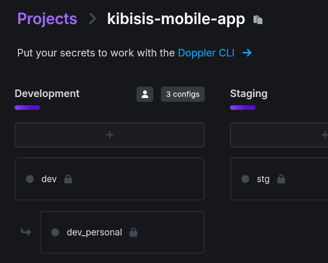

<p align="center">
  <a href="https://kibis.is">
    
  </a>
</p>

<h1 align="center">
  Kibisis Mobile App
</h1>

<h4 align="center">
  An AVM wallet that goes beyond just DeFi.
</h4>

<p align="center">
  <a href="https://github.com/agoralabs-sh/kibisis-mobile-app/releases/latest">
    
  </a>
  <a href="https://github.com/agoralabs-sh/kibisis-mobile-app/releases/latest">
    
  </a>
</p>

<p align="center">
  <a href="https://github.com/agoralabs-sh/kibisis-mobile-app/releases">
    
  </a>
  <a href="https://github.com/agoralabs-sh/kibisis-mobile-app/releases">
    
  </a>
</p>

<p align="center">
  <a href="https://github.com/agoralabs-sh/kibisis-mobile-app/blob/main/LICENSE">
    
  </a>
</p>

<p align="center">
  This is the Kibisis mobile app built in Flutter.
</p>

### Table of contents

* [1. Overview](#-1-overview)
* [2. Usage](#-2-usage)
* [3. Development](#-3-development)
    * [3.1. Requirements](#31-requirements)
    * [3.2. Create A Personal Doppler Config](#32-create-a-personal-doppler-config)
    * [3.3. Setup `doppler`](#33-setup-doppler)
    * [3.3. Run](#33-run)
* [4. Appendix](#-4-appendix)
    * [4.1. Useful Commands](#41-useful-commands)
* [5. How To Contribute](#-5-how-to-contribute)
* [6. License](#-6-license)

## 🗂️ 1. Overview

Coming soon...

## 🪄 2. Usage

Refer to the [documentation](https://kibis.is/overview) for information on how to use Kibisis.

<sup>[Back to top ^][table-of-contents]</sup>

## 🛠 3. Development

### 3.1. Requirements

* [Doppler CLI][doppler]
* [Flutter SDK v3.22.3][flutter]
* [Make][make] (optional)

<sup>[Back to top ^][table-of-contents]</sup>

## 3.2. Create A Personal Doppler Config

To start using your own Doppler config, go to the project on [Doppler](https://dashboard.doppler.com/workplace/ae8c01548486ba93b8fd/projects/kibisis-mobile-app) and press the "+" to create a new personal branch config in the "Development" config

<p align="center">
  
</p>

> ⚠️ **NOTE:** Use your name in lowercase with underscores instead of spaces (snake_case).

<sup>[Back to top ^][table-of-contents]</sup>

### 3.3. Setup `doppler`

Follow the instructions [here](https://docs.doppler.com/docs/install-cli#local-development) to:

* login to Doppler, and;
* setup Doppler to use the `kibisis-mobile-app` project with your personal config.

> ⚠️ **NOTE:** When naming your token, it is recommended you use: "<your_name>-<device_name>".

<sup>[Back to top ^][table-of-contents]</sup>

### 3.2. Install Dependencies

1. Simply run:
```bash
$ flutter pub get && ./scripts/post_install.sh
```

> ⚠️ **NOTE:** This will install the required dependencies and generate the development keys that can be used for signing the development version of the app.
> 
<sup>[Back to top ^][table-of-contents]</sup>

#### Using Make (optional)

Optionally you can just use make to perform the above by simply running:

```shell
make
```

<sup>[Back to top ^][table-of-contents]</sup>

### 3.3. Run

* To run simply use:
```bash
$ flutter run
```

<sup>[Back to top ^][table-of-contents]</sup>

## 📑 4. Appendix

### 4.1. Useful Commands

| Command        | Description                                                                   |
|----------------|-------------------------------------------------------------------------------|
| `make`         | Deletes the `build/` and `.dart_tool/` directories and installs dependencies. |
| `make clean`   | Deletes the `build/` and `.dart_tool/` directories.                           |

> ⚠️ **NOTE:** See the [Flutter CLI](https://docs.flutter.dev/reference/flutter-cli#flutter-commands) reference for a full list of available commands.

<sup>[Back to top ^][table-of-contents]</sup>

## 👏 5. How To Contribute

Please read the [**Contributing Guide**][contribute] to learn about the development process.

<sup>[Back to top ^][table-of-contents]</sup>

## 📄 6. License

Please refer to the [COPYING][license] file.

<sup>[Back to top ^][table-of-contents]</sup>

<!-- Links -->
[contribute]: ./CONTRIBUTING.md
[doppler]: https://docs.doppler.com/docs/install-cli
[flutter]: https://docs.flutter.dev/get-started/install
[make]: https://www.gnu.org/software/make/
[license]: ./COPYING
[table-of-contents]: #table-of-contents

